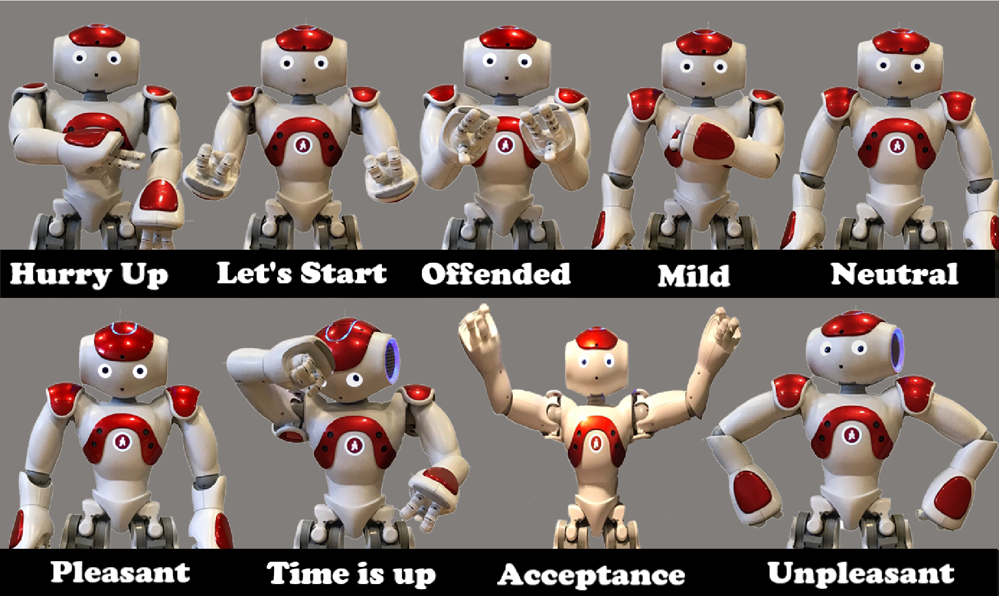
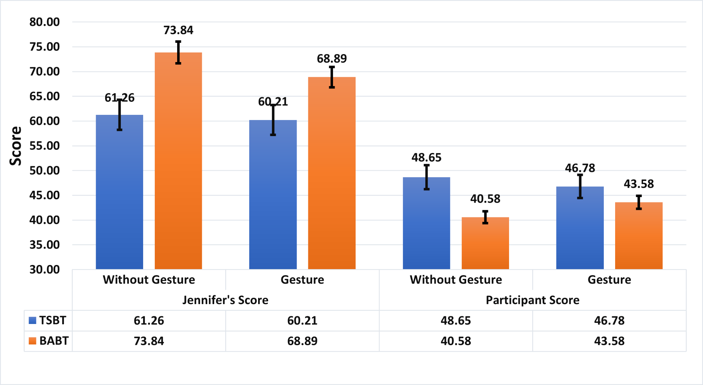

# Would You Imagine Yourself Negotiating With a Robot, Jennifer? Why Not? — [IEEE THMS 2022]

Reyhan Aydoğan · Mehmet Onur Keskin · Umut Çakan

[Paper](https://doi.org/10.1109/THMS.2021.3121664) · [Explore the method](METHOD.md) · [Try the code](#try-it-yourself) · [Study guide](docs/protocol.md) · [Citation](#cite-the-paper)

[](https://github.com/monurkeskin/Jennifer-Why-Not-THMS-2022/actions/workflows/tests.yml)

Jennifer can make the same offer with a neutral posture, a pleased gesture or a
visible sign of frustration. **Does that body language change the negotiation,
and does the answer depend on how she bargains?** This study brings the bidding
tactic and the robot's expression into the same experiment.

## Giving a negotiation strategy a physical expression



*Figure 3 from the paper. The gestures accompany moods chosen from the negotiation
state and changes in the human's offers; Table I gives the mood–argument rules.*

The study uses a mixed design. Each person negotiates **with and without gestures**,
in counterbalanced order. The bidding tactic is assigned **between participant
groups**. Two versions of the deserted-island resource profile accompany the two
session positions.

| Experimental factor | Conditions | Compared across |
| --- | --- | --- |
| Bidding tactic | Time-dependent stochastic (TSBT); behavior-based adaptive (BABT) | Separate participant groups |
| Gesture | Enabled; disabled | The same participant's two sessions |
| Resource profile | First-session and second-session point tables | Session position |

TSBT concedes with time. BABT responds to the human's bidding behavior. This lets
the study examine whether a gesture supports or conflicts with the bargaining
rule behind it.

## Strategy and expression have a joint effect



*Figure 7. The utility comparison includes 42 participants who reached agreement
in both conditions: 23 in TSBT and 19 in BABT. The larger agreement-rate analysis
uses 60 participants whose speech and recorded bids passed the study's checks.*

| Jennifer's mean agreement score | With gestures | Without gestures |
| --- | ---: | ---: |
| TSBT | 60.21 | 61.26 |
| BABT | 68.89 | 73.84 |

BABT produced higher agent scores than TSBT in the published analysis. Within
BABT, agent scores were lower with gestures ($p=0.018$); the corresponding TSBT
comparison was not significant. The result motivates studying **what the robot
does and how it expresses that decision together**. It does not establish that
gestures uniformly help or harm negotiation.
[Paper Section VI-C and Figure 7](https://doi.org/10.1109/THMS.2021.3121664) ·
[Figure sources](docs/paper/README.md).

## What you can explore

Inspect all four tactic/order configurations, the published resource profiles and the difference between a formal bid and an interaction notification. Start with a text-only example, then use the protocol guide to prepare a device-backed study.

| Explore | Start with | What it shows |
| --- | --- | --- |
| Study design | [CONFIGURATIONS.md](CONFIGURATIONS.md) | Compare four tactic/gesture-order configurations. |
| Protocol | [docs/protocol.md](docs/protocol.md) | Practice, two main sessions, break and questionnaire timing. |
| Profiles | [tests/test_paper_profiles.py](tests/test_paper_profiles.py) | Check every allocation against the published tables. |

The configurations, method checks and study guides are specific to this paper. The shared [NEGOTIATOR framework](https://github.com/monurkeskin/NEGOTIATOR-IJCAI-2024) runs the negotiation,
participant/conductor views and session analysis. Its exact **2.1.0** revision is
pinned in [framework.json](framework.json); installation brings it in automatically.

This package preserves the experimental factor structure and published point tables. The maintained BABT offer selector, numerical mood thresholds and speech/gesture assets need to be distinguished from the historical implementation; [METHOD.md](METHOD.md) records that boundary.

## Try it yourself

Use Python 3.11 or 3.12 and Git. This first example runs locally without a robot,
camera or service account.

```bash
git clone https://github.com/monurkeskin/Jennifer-Why-Not-THMS-2022.git
cd Jennifer-Why-Not-THMS-2022
python3 -m venv .venv
source .venv/bin/activate
python -m pip install -r requirements.txt
python run.py --output demo-output
```

On Windows, create the environment with `py -3 -m venv .venv` and activate it with
`.venv\Scripts\Activate.ps1` in PowerShell.

Open **`demo-output/report/index.html`** to follow the example negotiation. The
output includes offers, utility trajectories, session records and exportable
figures. These are synthetic examples for exploring the software and method.
[Installation help](docs/compatibility.md).

### Read a calculation or open the study workspace

```bash
negotiator reproduce reproduction/method.json --output method-output
negotiator gui
```

In **New study → Import a paper or study configuration**, select
`configs/synthetic.json` for the demonstration, or `configs/protocol-babt-gesture-first.json`
to inspect the paper's protocol template. The [study guide](docs/protocol.md)
explains the remaining protocol/asset requirements and device setup.

## Data and analysis

Participant records and recordings are not included. The examples use labeled
synthetic inputs so you can run the code and inspect its calculations. Recomputing
the human-study results requires authorized access to the original inputs and
the matching analysis procedure.

[Reproducibility guide](REPRODUCIBILITY.md) · [Paper-to-code map](paper-map.json) ·
[Analysis guide](docs/analysis.md)

## Build on the work

To change a paper condition, start with its configuration and add a small test
showing the intended behavior. Shared negotiation rules belong in NEGOTIATOR;
paper-specific profiles, protocols and result recipes belong here. The
[development guide](docs/development.md) walks through these boundaries and the
test-first workflow. [Contribution guide](CONTRIBUTING.md).

## Cite the paper

If you use this method or study design, please cite the associated paper:

```bibtex
@article{jennifernegotiation2022,
  title = {Would You Imagine Yourself Negotiating With a Robot, Jennifer? Why Not?},
  author = {Aydoğan, Reyhan and Keskin, Mehmet Onur and Çakan, Umut},
  year = {2022},
  doi = {10.1109/THMS.2021.3121664},
  url = {https://doi.org/10.1109/THMS.2021.3121664}
}
```

The [citation file](CITATION.cff) provides the paper as the preferred citation.
For software provenance, record the [2.1.0 release](https://github.com/monurkeskin/Jennifer-Why-Not-THMS-2022/releases/tag/v2.1.0) and commit used. The earlier [archived 2.0.0 artifact](https://doi.org/10.5281/zenodo.22729004) remains available.
When using the shared engine in new research, cite the
[NEGOTIATOR framework paper](https://doi.org/10.24963/ijcai.2024/1012).
GPL-3.0-only; original contributors and sources are credited in [NOTICE](NOTICE).
