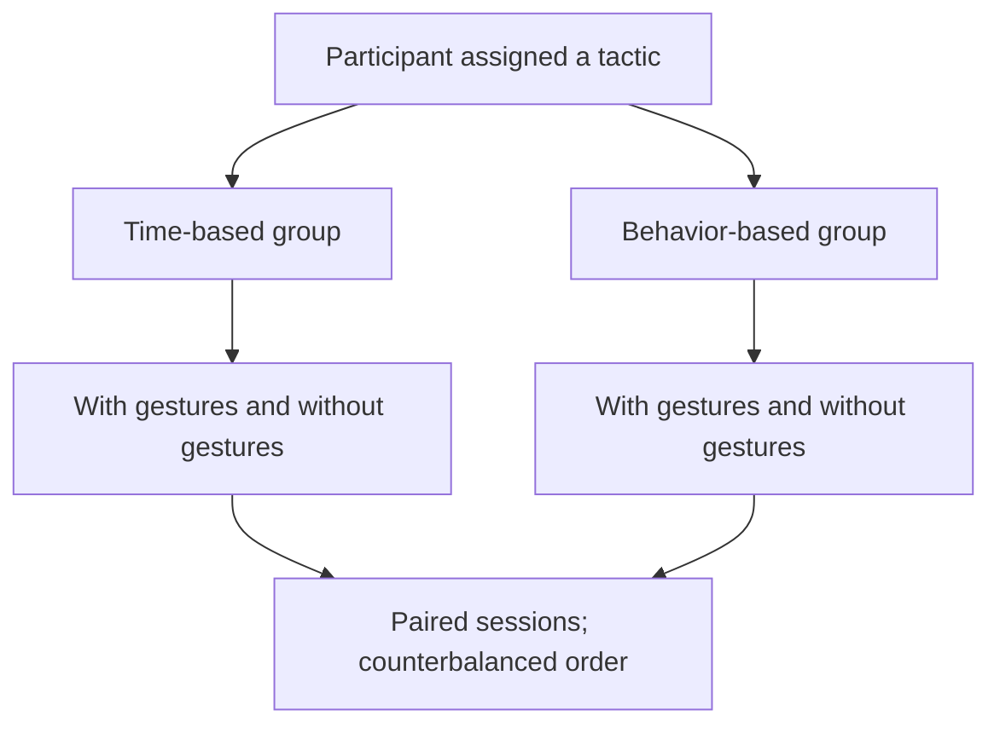

# Would You Imagine Yourself Negotiating With a Robot, Jennifer? Why Not? — [IEEE THMS 2022]

Reyhan Aydoğan · Mehmet Onur Keskin · Umut Çakan

[Paper](https://doi.org/10.1109/THMS.2021.3121664) · [Explore the method](METHOD.md) · [Try the code](#try-it-yourself) · [Study guide](docs/protocol.md) · [Citation](#cite-the-paper)

[](https://github.com/monurkeskin/Jennifer-Why-Not-THMS-2022/actions/workflows/tests.yml)
[](https://doi.org/10.5281/zenodo.22729004)

**Does a robot's gesture change a negotiation—and does the answer depend on how the robot bargains?**

This study brings negotiation tactics and physical expression together. Participants negotiate with Jennifer with and without gestures, while separate participant groups encounter either a time-based or a behavior-based tactic.

## The idea

Gesture is varied **within participants**; tactic is varied **between groups**. This distinction matters when comparing outcomes. Each participant follows two main sessions, with score profiles attached to session position and robot gesture order counterbalanced.



## In the paper

The paper reports higher robot utility for the behavior-based tactic and a gesture effect within that tactic. Its result is about the combination of bargaining behavior and expression; it should not be read as a uniform benefit of gestures across all strategies. [Read the paper](https://doi.org/10.1109/THMS.2021.3121664).

## Explore this work

Inspect all four tactic/order configurations, the published resource profiles and the difference between a formal bid and an interaction notification. Start with a text-only example, then use the protocol guide to prepare a device-backed study.

| Explore | Start with | What it shows |
| --- | --- | --- |
| Study design | `CONFIGURATIONS.md` | Compare four tactic/gesture-order configurations. |
| Protocol | `docs/protocol.md` | Practice, two main sessions, break and questionnaire timing. |
| Profiles | `tests/test_paper_profiles.py` | Check every allocation against the published tables. |

This repository holds the paper-specific configurations, method checks and study
guides. The shared [NEGOTIATOR framework](https://github.com/monurkeskin/NEGOTIATOR-IJCAI-2024) runs the negotiation,
participant/conductor views and session analysis. Its exact **2.0.0** revision is
pinned in [framework.json](framework.json); installation brings it in automatically.

This package preserves the experimental factor structure and published point tables. The maintained BABT offer selector, numerical mood thresholds and speech/gesture assets need to be distinguished from the historical implementation; [METHOD.md](METHOD.md) records that boundary.

## Try it yourself

Use Python 3.11 or 3.12 and Git. This first example runs locally without a robot,
camera or service account.

```bash
git clone https://github.com/monurkeskin/Jennifer-Why-Not-THMS-2022.git
cd Jennifer-Why-Not-THMS-2022
python3 -m venv .venv
source .venv/bin/activate
python -m pip install -r requirements.txt
python run.py --output demo-output
```

On Windows, create the environment with `py -3 -m venv .venv` and activate it with
`.venv\Scripts\Activate.ps1` in PowerShell.

Open **`demo-output/report/index.html`** to follow the example negotiation. The
output includes offers, utility trajectories, session records and exportable
figures. These are synthetic examples for exploring the software and method.
[Installation help](docs/compatibility.md).

### Read a calculation or open the study workspace

```bash
negotiator reproduce reproduction/method.json --output method-output
negotiator gui
```

In **New study → Import a paper or study configuration**, select
`configs/synthetic.json` for the demonstration, or `configs/protocol-babt-gesture-first.json`
to inspect the paper's protocol template. The [study guide](docs/protocol.md)
explains the remaining protocol/asset requirements and device setup.

## Data and reproducibility

Participant-level records and audio/video recordings are **not distributed in this
repository**. Restricted access is compatible with sharing the method, protocol and
analysis code; it does not require releasing human-study data publicly. The package
provides synthetic inputs and documents which computations can be run from them.
Recomputing the published human-study statistics additionally requires authorized
access to the relevant inputs and the corresponding analysis specification.

[Reproducibility guide](REPRODUCIBILITY.md) · [Paper-to-code map](paper-map.json) ·
[Analysis guide](docs/analysis.md)

## Build on the work

To change a paper condition, start with its configuration and add a small test
showing the intended behavior. Shared negotiation rules belong in NEGOTIATOR;
paper-specific profiles, protocols and result recipes belong here. The
[development guide](docs/development.md) walks through these boundaries and the
test-first workflow. [Contribution guide](CONTRIBUTING.md).

## Cite the paper

If you use this method or study design, please cite the associated paper:

```bibtex
@article{jennifernegotiation2022,
  title = {Would You Imagine Yourself Negotiating With a Robot, Jennifer? Why Not?},
  author = {Aydoğan, Reyhan and Keskin, Mehmet Onur and Çakan, Umut},
  year = {2022},
  doi = {10.1109/THMS.2021.3121664},
  url = {https://doi.org/10.1109/THMS.2021.3121664}
}
```

The [citation file](CITATION.cff) provides the paper as the preferred citation.
For software provenance, also record the version and [archived 2.0.0 artifact](https://doi.org/10.5281/zenodo.22729004).
When using the shared engine in new research, cite the
[NEGOTIATOR framework paper](https://doi.org/10.24963/ijcai.2024/1012).
GPL-3.0-only; original contributors and sources are credited in [NOTICE](NOTICE).
